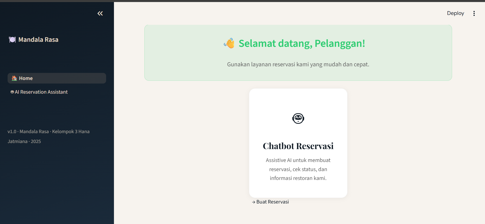
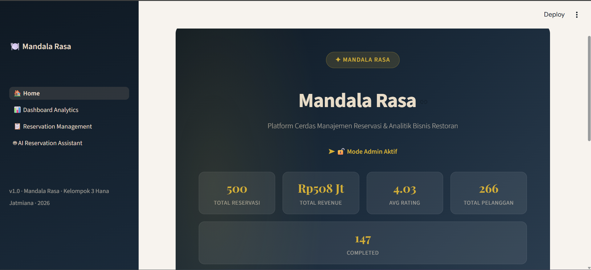
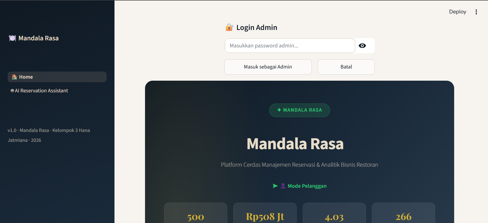
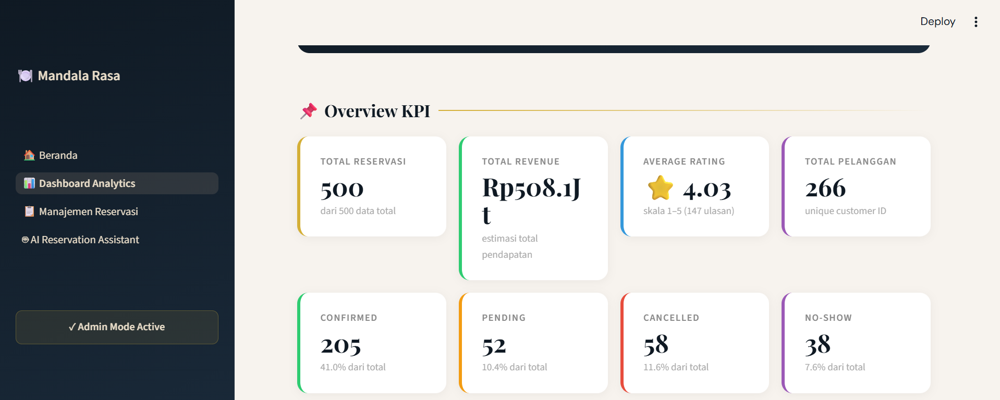
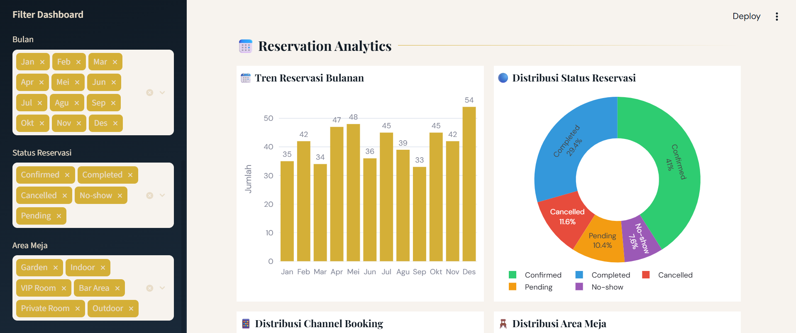
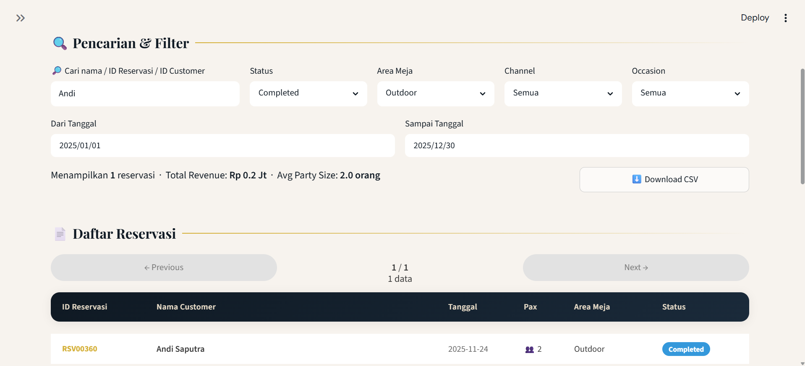
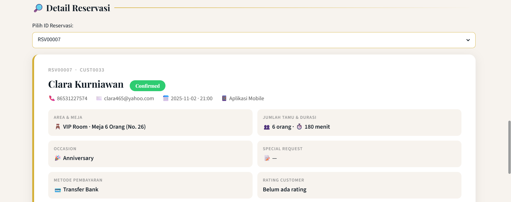
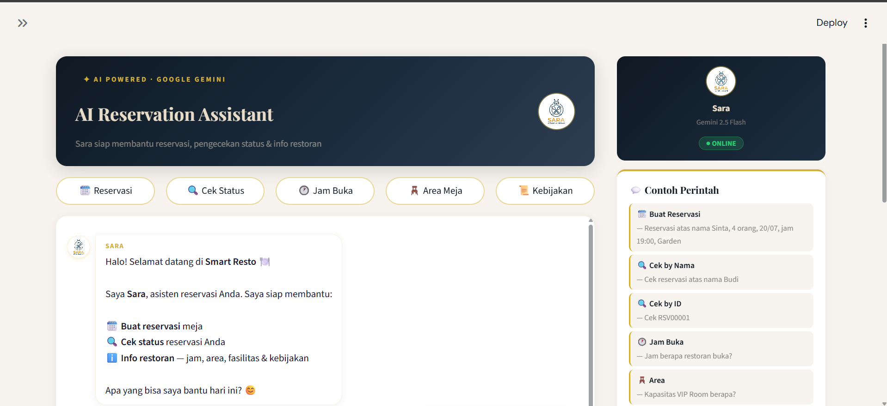
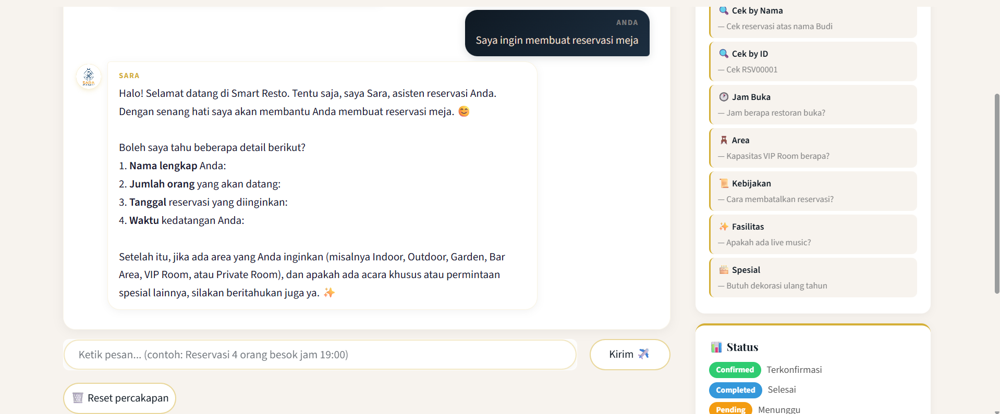

# 🍽️ Mandala Rasa – Smart Reservation Dashboard

> **Capstone Project · CAMP Batch 4 · Kelompok 3 – Hana Jatmiana · 2026**

Platform manajemen reservasi restoran berbasis AI yang dibangun dengan **Streamlit** dan didukung oleh **Google Gemini 2.5 Flash**. Aplikasi ini menyediakan dua mode akses terpisah — portal pelanggan untuk reservasi via chatbot, dan portal admin dengan dashboard analitik bisnis secara penuh.

---

## 📸 Screenshots

### 1. Halaman Beranda – Mode Pelanggan


---

### 2. Halaman Beranda – Mode Admin (Setelah Login)


---

### 3. Panel Login Admin


---

### 4. Dashboard Analytics – Overview KPI


---

### 5. Dashboard Analytics – Grafik Reservasi & Revenue


---

### 6. Manajemen Reservasi – Filter & Tabel Data


---

### 7. Manajemen Reservasi – Detail Reservasi


---

### 8. AI Reservation Assistant – Tampilan Chat (Kosong)


---

### 9. AI Reservation Assistant – Percakapan Aktif


---

## 🗂️ Struktur Project

```
restaurant_dashboard/
├── Beranda.py                      # Entry point – landing page & login admin
├── utils.py                        # Data loader, shared CSS, konstanta warna
├── data.json                       # Dataset sintetis 500 reservasi
├── Sara_logo.png                   # Logo SARA untuk tampilan chat header
├── requirements.txt                # Dependensi Python
├── README.md                       # Dokumentasi ini
├── .env                            # API key (tidak di-commit ke Git)
├── .gitignore
├── .streamlit/
│   └── config.toml                 # Tema, warna primary, server config
└── pages/
    ├── 1_Dashboard_Analytics.py    # Dashboard KPI & visualisasi Plotly
    ├── 2_Reservation_Management.py # Manajemen & detail reservasi
    └── 3_AI_Assistant.py           # Chatbot SARA berbasis Gemini API
```

---

## 🚀 Cara Menjalankan

### 1. Clone / Download Project

```bash
git clone <repo-url>
cd restaurant_dashboard
```

### 2. Buat Virtual Environment (Opsional tapi Disarankan)

```bash
python -m venv venv
source venv/bin/activate        # Linux / macOS
venv\Scripts\activate           # Windows
```

### 3. Install Dependencies

```bash
pip install -r requirements.txt
```

### 4. Konfigurasi API Key

Buat file `.env` di folder root project, lalu isi dengan API key Gemini kamu:

```env
GOOGLE_API_KEY="isi_dengan_api_key_gemini_kamu"
```

> Dapatkan API key gratis di [Google AI Studio](https://aistudio.google.com/app/apikey).

### 5. Jalankan Aplikasi

```bash
streamlit run Beranda.py
```

Akses di browser: **http://localhost:8501**

---

## 🔑 Sistem Login Admin

Aplikasi menggunakan sistem role-based access yang disimpan di `st.session_state`:

| State | Nilai Default | Keterangan |
|---|---|---|
| `admin_logged_in` | `False` | Status login admin saat ini |
| `show_admin_login` | `False` | Menampilkan/menyembunyikan panel login |

**Langkah login:**
1. Klik tombol **🔐 Admin Login** di pojok kanan atas halaman Beranda
2. Panel input password akan muncul di bawah tombol
3. Masukkan password lalu klik **Masuk sebagai Admin**

**Password default:** `admin123`

**Setelah login berhasil:**
- Tombol berubah menjadi **🚪 Logout**
- Hero badge berubah dari hijau "Mode Pelanggan" menjadi gold "Mode Admin Aktif"
- Tiga nav card muncul sekaligus: Dashboard Analytics, Manajemen Reservasi, AI Assistant
- Seluruh halaman admin dapat diakses

> ⚠️ Untuk production, ganti password default dan pertimbangkan menggunakan environment variable.

---

## 📊 Fitur Dashboard Analytics

Halaman ini hanya dapat diakses oleh admin. Seluruh chart menggunakan **Plotly** dengan styling yang konsisten (background putih, aksen gold).

### Filter Global
- **Filter Area Meja** – multiselect untuk menyaring seluruh visualisasi berdasarkan area (Indoor, Outdoor, Private, VIP)

### Overview KPI
| KPI | Deskripsi |
|---|---|
| Total Reservasi | Jumlah seluruh reservasi di dataset |
| Total Revenue | Estimasi total pendapatan dalam IDR |
| Average Rating | Rata-rata rating pelanggan (skala 1–5) |
| Total Pelanggan Unik | Jumlah customer ID yang berbeda |
| Completed | Jumlah reservasi berstatus Completed |
| Breakdown Status | Pill badge Confirmed / Pending / Cancelled / No-show |

### Reservation Analytics
- 📊 Tren Reservasi Bulanan (bar chart)
- 🥧 Distribusi Status Reservasi (pie chart)
- 📊 Distribusi Channel Booking (horizontal bar: Walk-in, Online, Phone, App)
- 🥧 Distribusi Area Meja (donut chart)
- 📊 Distribusi Occasion (bar chart: Anniversary, Birthday, Business, dll.)

### Revenue Analytics
- 💰 Revenue per Channel Booking (horizontal bar)
- 💰 Revenue per Area Meja (bar)
- 💰 Revenue per Occasion (bar)
- 📈 Tren Revenue Bulanan (line/bar)

### Customer Analytics
- 👥 Distribusi Party Size
- ⭐ Distribusi Rating
- 💳 Distribusi Metode Pembayaran

---

## 📋 Fitur Manajemen Reservasi

Halaman ini hanya dapat diakses oleh admin.

### Filter & Pencarian
- 🔎 Cari berdasarkan nama pelanggan, Reservation ID, atau Customer ID
- Filter Status: Confirmed, Completed, Pending, Cancelled, No-show
- Filter Area Meja
- Filter Channel Booking

### Tabel Data
- Menampilkan semua reservasi yang cocok dengan filter
- Klik baris untuk membuka **Detail Reservasi**

### Detail Reservasi
Panel detail yang muncul saat baris diklik, menampilkan:
- Nama lengkap pelanggan + nomor HP + email
- Reservation ID & Customer ID
- Area Meja, Tipe Meja, dan Nomor Meja
- Tanggal & waktu reservasi
- Jumlah tamu (party size) & occasion
- Status reservasi + metode pembayaran
- Estimasi revenue (IDR)
- Rating & catatan khusus

### Export Data
- Tombol **⬇️ Download CSV** untuk mengekspor hasil filter ke file `reservasi_export.csv`

---

## 🤖 AI Reservation Assistant (SARA)

**SARA** (Smart Reservation Assistant for Restaurant) adalah chatbot yang ditenagai oleh **Google Gemini 2.5 Flash** via REST API.

### Fitur Utama
- **Reservasi baru** – membantu pelanggan membuat reservasi dengan mengumpulkan data: nama, jumlah tamu, tanggal, waktu, area, dan occasion
- **Cek status reservasi** – pelanggan bisa menanyakan status reservasi berdasarkan nama atau ID
- **Informasi restoran** – menjawab pertanyaan umum tentang jam buka, menu, fasilitas, lokasi, dsb.
- **Fallback heuristik** – jika API tidak tersedia, SARA tetap bisa merespons dengan logika berbasis rule

### Tools Agentic
| Tool | Fungsi |
|---|---|
| `cek_reservasi_tool(query)` | Mencari reservasi berdasarkan nama/ID di `data.json` |
| `buat_reservasi_tool(...)` | Membuat entri reservasi baru (nama, pax, tanggal, waktu, area, occasion) |
| `detect_intent(msg)` | Mendeteksi intent pesan: reservasi, cek status, info, atau umum |
| `extract_params(msg)` | Mengekstrak parameter dari pesan natural language |

### Quick Action Buttons
Tombol shortcut di atas chat window:
- 📅 Buat Reservasi
- 🔍 Cek Status
- 🍽️ Info Restoran
- 📞 Hubungi Kami

### Konfigurasi Model
```
Model   : gemini-2.5-flash
Endpoint: generativelanguage.googleapis.com/v1beta/models/gemini-2.5-flash:generateContent
API Key : dari env variable GOOGLE_API_KEY
```

---

## 🎨 Desain & UI/UX

### Color Palette

| Token | Hex | Penggunaan |
|---|---|---|
| Gold | `#d4af37` | Primary accent, border, badge, button |
| Dark Navy | `#0f1923` | Background sidebar, hero section, text utama |
| Cream | `#e8dcc8` | Text di atas background gelap |
| Light Cream | `#f7f3ee` | Background halaman utama |
| White | `#ffffff` | Card background, chat window |

### Tipografi
- **Playfair Display** (serif) – heading, judul section, nilai KPI
- **DM Sans** (sans-serif) – body text, label, badge

### Komponen CSS Kustom
- `.kpi-card` – card KPI dengan border kiri berwarna aksen
- `.section-title` – judul section dengan garis dekoratif gold
- `.nav-card` – card navigasi dengan hover effect (lift + border gold)
- `.hero-wrap` – hero banner dengan gradient gelap dan radial gold overlay
- `.mini-stat` – stat mini di hero section
- `.back-button` – tombol gradient gold untuk kembali ke beranda
- `.chat-header` – header banner chatbot SARA
- `.filter-card` – card filter di halaman manajemen reservasi
- `.detail-card` – card detail reservasi

### Tema Streamlit (`.streamlit/config.toml`)
```toml
[theme]
base             = "light"
primaryColor     = "#d4af37"
backgroundColor  = "#f7f3ee"
secondaryBackgroundColor = "#ffffff"
textColor        = "#0f1923"
```

---

## 🛠️ Teknologi

| Layer | Stack |
|---|---|
| Framework | Streamlit ≥ 1.32.0 |
| Visualisasi | Plotly Express & Graph Objects |
| Data Processing | Pandas ≥ 2.0.0, JSON |
| AI / LLM | Google Gemini 2.5 Flash (via REST API) |
| Environment | python-dotenv |
| Export | openpyxl (support CSV download) |
| Deployment | Streamlit Community Cloud / Local |

---

## ⚙️ Konfigurasi Lanjutan

### Mengganti Password Admin
Di file `Beranda.py`, ubah baris berikut:
```python
ADMIN_PASSWORD = "admin123"
```
Untuk keamanan lebih, simpan sebagai environment variable:
```python
ADMIN_PASSWORD = os.getenv("ADMIN_PASSWORD", "admin123")
```

### Mengganti Dataset
Ganti file `data.json` di root folder. Pastikan kolom berikut tersedia:
`Tanggal`, `Nama Customer`, `Customer ID`, `Reservation ID`, `No. HP`, `Email`, `Area Meja`, `Tipe Meja`, `Nomor Meja`, `Party Size`, `Occasion`, `Status`, `Channel`, `Metode Pembayaran`, `Total Estimasi (IDR)`, `Rating`

### Deploy ke Streamlit Cloud
1. Push project ke GitHub (pastikan `.env` masuk `.gitignore`)
2. Buka [share.streamlit.io](https://share.streamlit.io) → **New app**
3. Pilih repo dan set **Main file path**: `Beranda.py`
4. Tambahkan `GOOGLE_API_KEY` di menu **Secrets** (Settings → Secrets)

---

## 👥 Tim Pengembang

| Anggota | Peran |
|---|---|
| Achmad Raka Yuniar | Project Leader & Backend Developer |
| William Yonathan | AI Engineer |
| Milda Khaerunnisa | Data & Analytics Developer |
| Muhammad Ad'hiya Hartono | Frontend & UI/UX Developer |
| Alfin Agustiar Pratama | QA & Integration Engineer |
| Arya | Data Scientist & Deployment |

> Dibimbing oleh **Hana Jatmiana** – Mentor Kelompok 3, CAMP Batch 4

---

## 📄 Lisensi

Project ini dibuat sebagai capstone project untuk keperluan akademis dalam program **Data Science & Generative AI – CAMP Batch 4**. Tidak untuk distribusi komersial.

---

*© 2026 Smart Reservation Assistant · Kelompok 3 Hana Jatmiana · Dibuat dengan ❤️ menggunakan Streamlit*
